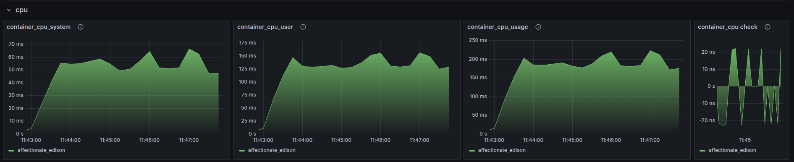
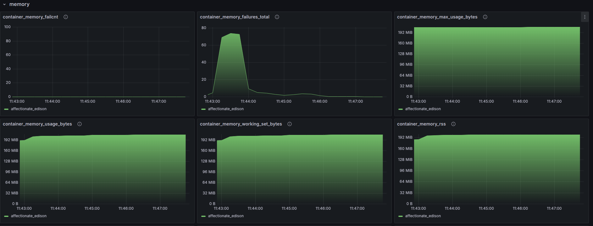
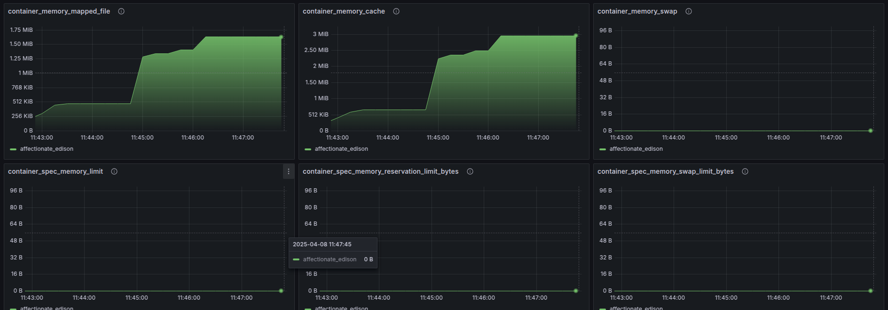

# 📊 WAF Load Testing Report

## 🗓️ Test Date
April 8, 2025

## 🌟 Purpose of Testing
Evaluate the resilience, correctness, and performance of the WAF service under high traffic load, including the effectiveness of filtering and IP blocking mechanisms.

## ⚙️ System Configuration

### WAF Jail Manager

```yaml
filterRules:
  - name: "flexible-rule-1"
    type: "flexible"
    conditions:
      - field: 'url'
        check:
          - method: 'equals'
            values: [ "/admin.php", "phpinfo.php", ".env" ]
          - method: 'regexp'
            values: [ "/wp-(admin|include|content)/i" ]
    period: 60
    limit: 20
    duration: 3
    escalationRate: 1.3
```

### HAProxy Configuration

```haproxy
frontend http_in
  bind *:80
  acl trusted_proxy src <Cloudflare ranges>
  http-request set-src hdr_ip(Cf-Connecting-Ip)
  use_backend waf_backend if { nbsrv(waf_backend) gt 0 }
  default_backend direct_site_backend

frontend waf_filtered_in
  bind *:8080
  http-request set-header X-From-WAF true
  default_backend direct_site_backend

backend waf_backend
  server waf 127.0.0.1:3000 check

backend direct_site_backend
  server direct1 10.0.0.3:80 check
```

## 📈 Testing Methodology

- **Rate**: 70 to 100 RPS (requests per second)
- **Duration**: 5 minutes
- **Test Requests**: Targeted URLs matching the flexible-rule
- **Monitoring**: Logging enabled for `JailManager` and `FlexibleRule`

## 📄 Results

### Sample of Tested URLs

The following is a representative sample of URLs used during the load testing process:

```
/bytes/20
/anything
/bytes/30
/image
/headers
/image/jpeg
/image/png/swg
/anything/foo.php
/anything/wp-admin
```

These endpoints include static assets, dynamic endpoints, and some suspicious patterns intended to trigger the WAF rules.


### Flexible-Rule Triggering

IP `10.0.0.2` repeatedly exceeded the 20 suspicious requests per 60-second window, resulting in jail blocks. Each time, the `escalationCount` increased as expected:

- First block: `08:57:34.613` (no escalation)
- Second block: `08:58:36.078` (`escalationCount: 1`)
- Third block: `08:59:33.507` (`escalationCount: 2`)
- Fourth block: `09:00:30.136` (`escalationCount: 3`)

### 📋 System Behavior

- Counters were correctly reset every period.
- Repeated violations increased block durations.
- No packet loss; logs showed stable and predictable behavior.

### 📉 Metrics

- 
-
- 
-
- 

### Load Testing Utility Output

```
Percentiles (all/last 1m/last), ms:
100.0% < 1,160.0  1,160.0  145.8
 99.5% <   160.0    166.0  145.8
 99.0% <   147.0    160.0  144.9
 95.0% <   133.0    141.0  134.8
 90.0% <   118.0    136.0  133.0
 85.0% <   113.0    134.0  130.3
 80.0% <   109.0    131.0  129.5
 75.0% <   103.0    121.0  128.9
 70.0% <   100.0    117.0  128.9
 60.0% <    97.0    112.0  110.0
 50.0% <    94.0    110.0  106.9
 40.0% <    92.0    102.0  106.0
 30.0% <    91.0     99.0   97.0
 20.0% <    89.0     95.0   95.0
 10.0% <    86.0     91.0   93.0

HTTP codes:
21,452   85.47% : 200 OK
 1,882    7.50% : 404 Not Found
 1,765    7.03% : 429 N/A

Net codes:
25,099  100.00% : 0 Success

Average Sizes (all/last), bytes:
Request:    70.3 /  70.2
Response: 4,658.3 / 807.9

Average Times (all/last), ms:
Overall: 99.34 / 111.13
Connect: 27.88 /  36.53
   Send:  0.03 /   0.03
Latency: 69.34 /  74.51
Receive:  2.09 /   0.06
```

## ✅ Conclusions

- WAF successfully identifies and blocks violating IPs.
- Escalation mechanism works as designed.
- HAProxy correctly forwards real client IPs via Cloudflare headers.
- The system handled up to 100 RPS without visible performance degradation.

---

